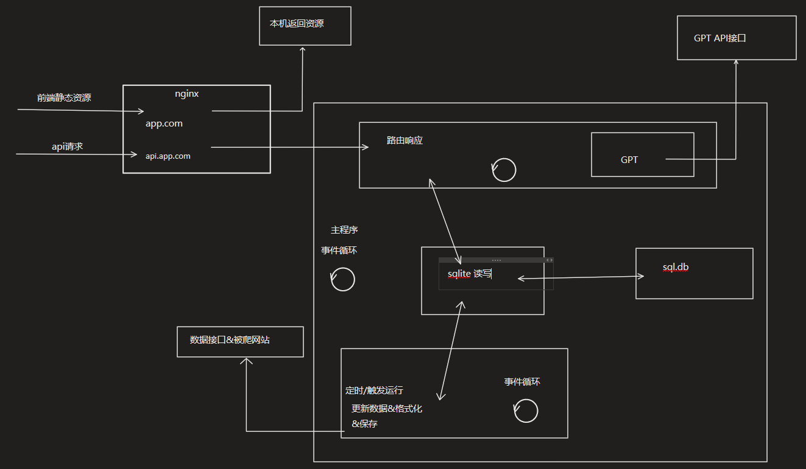

# 开发规范
## 项目综述
main.py 为项目入口函数，负责维护两个线程 web 和 crawler，如

模块 web 和 crawler 相互独立，以尽量互不干扰为原则，线程间**无数据交互**

模块 commons 下为通用模块，主要用途为定义数据结构以及读写工具函数

## 模块划分
web 和 crawler 由两人独立负责，一般情况下遵守不改动对方代码的原则，git commit 不改动对方代码，避免合并冲突

commons 为通用代码，前期改动可能较大，如需改动提前说明；后期逐渐稳定，改动趋缓

## 模块引用
遵循以下格式
```
import (python 标准库)

import (第三方库)

import (自定义模块)
```
任意为 main.py 子模块的模块均使用相对引用

## 单元测试
单元测试为 _test.py 为后缀，对同名模块进行测试

单元测试代码不属于 main.py 的子模块!

## commits
每一个 commits 只实现一到两个事，commits 分点编写，中英文无要求